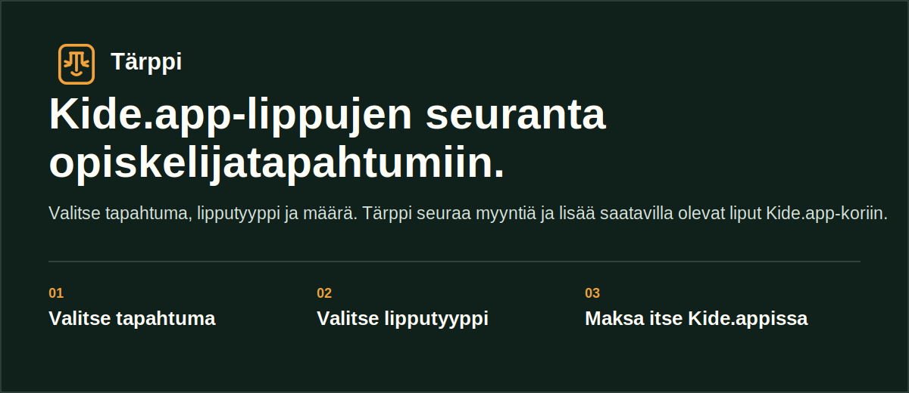

<p align="center">
  
</p>

<p align="center">
  <a href="https://www.tarppi.site">Avaa Tärppi</a> ·
  <a href="https://www.tarppi.site/miten-toimii">Miten se toimii</a> ·
  <a href="https://www.tarppi.site/kide-app-token">Token-opas</a>
</p>

# Tärppi

Tärppi on Kide.app-lippujen seurantaan tehty ohjelma opiskelijatapahtumiin. Valitse tapahtuma, lipputyyppi ja määrä. Kun lippuja tulee saataville, Tärppi yrittää lisätä ne Kide.app-koriin.

Maksu tehdään aina itse Kide.appissa. Tärppi ei käsittele maksukortteja eikä viimeistele ostoa.

- Palvelu: [tarppi.site](https://www.tarppi.site)
- Julkinen lähdekoodi: [Murtsi/tarppi](https://github.com/Murtsi/tarppi)
- Tekijä: [Antti Murtokangas](https://www.anttimurtokangas.com)

## Käyttö

1. Lisää **Kide.app-token** asetuksista ja tarkista, että se toimii.
2. Valitse kaupunki tai liitä suora Kide.app-tapahtuman linkki.
3. Valitse tapahtuma, lipputyyppi ja määrä.
4. Käynnistä seuranta.
5. Kun liput ovat korissa, avaa Kide.app ja maksa itse.

## Tarvitset nämä

### Kide.app-token

Kide.app-token on tärkein asetus. Ilman sitä Tärppi ei voi lisätä lippuja omaan Kide.app-koriisi.

Token tallennetaan vain selaimen istuntoon. Kun selain suljetaan, se pitää lisätä tarvittaessa uudelleen. Ohje löytyy sivulta [`/kide-app-token`](https://www.tarppi.site/kide-app-token).

### Telegram Chat ID

**Telegram Chat ID** on vapaaehtoinen. Sitä käytetään vain Telegram-ilmoituksiin, esimerkiksi kun liput ovat siirtyneet koriin. Se ei korvaa Kide.app-tokenia eikä vaikuta seurannan toimintaan.

## Miten tapahtumat näkyvät Tärpissä?

Tärppi hakee tapahtumalistan valitulla kaupunkirajauksella ja suodattaa siitä pois esimerkiksi päättyneet tapahtumat, jo alkaneen myynnin loppuunmyydyt tapahtumat sekä ilmaiset tapahtumat. Tulossa olevat myynnit pidetään mukana, vaikka lippuja ei olisi vielä saatavilla.

Siksi Tärpissä näkyvä tapahtumamäärä voi olla eri kuin Kide.appin omalla sivulla. Kide.appin näkymä ja Tärpin rajaukset eivät laske samoja tapahtumia, ja **Kaikki**-valinta kokoaa useamman kaupungin tuloksia samaan listaan.

## Sivut

| Reitti | Sisältö |
| --- | --- |
| [`/`](https://www.tarppi.site/) | Tärppi-sovellus: tapahtumat, lipputyypit ja seuranta |
| [`/miten-toimii`](https://www.tarppi.site/miten-toimii) | Käyttöönotto ja seurannan vaiheet |
| [`/kide-app-token`](https://www.tarppi.site/kide-app-token) | Kide.app-tokenin hakeminen ja lisääminen |
| [`/kide-app-lippujen-seuranta`](https://www.tarppi.site/kide-app-lippujen-seuranta) | Kide.app-lippujen seurannan kuvaus |
| [`/ukk`](https://www.tarppi.site/ukk) | Usein kysytyt kysymykset |
| [`/tietoa`](https://www.tarppi.site/tietoa) | Tausta, tekniikka ja GitHub-linkki |

## Projektin rakenne

| Polku | Tarkoitus |
| --- | --- |
| `src/App.tsx` | Sovelluksen päätila, seurannan käynnistys ja reititys |
| `src/components/lt/SimpleDashboard.tsx` | Tapahtumat, lipputyypit, loki ja seurannan tila |
| `src/components/lt/TokenDrawer.tsx` | Token, ilmoitukset, seuranta-asetukset ja ulkoasu |
| `src/components/lt/SimpleCityPicker.tsx` | Kaupunkivalinta ja Kaikki-rajaus |
| `src/pages/` | Julkiset info- ja ohjesivut |
| `src/lib/kide/api.ts` | Sovelluksen API-kutsut |
| `src/lib/kide/types.ts` | API-vastausten TypeScript-tyypit |

Sivukohtaiset hakukonemetatiedot ovat `src/pages/SeoMeta.tsx`-komponentissa. Perustason metatiedot ja staattiset hakukonetiedostot ovat `index.html`-, `public/robots.txt`- ja `public/sitemap.xml`-tiedostoissa.

## Paikallinen kehitys

```bash
npm install
npm test
npm run lint
npm run build
npm run dev
```

Paikallisessa kehityksessä sovellus voi käyttää tätä osoitetta:

```bash
VITE_API_URL=http://localhost:3000
```

## Turvarajat

- Tärppi voi yrittää lisätä liput koriin, mutta ei maksa niitä.
- Vastaat itse Kide.app-tokenista, lipputyypin valinnasta ja maksusta.
- Älä lisää tokeneita, ympäristömuuttujia tai muita salaisuuksia repoihin.
- Julkisessa repossa on vain selainpuolen lähdekoodi.

Tärppi on epävirallinen työkalu. Se ei ole Kide.appin tuote, eikä Kide.app vastaa sen toiminnasta.
